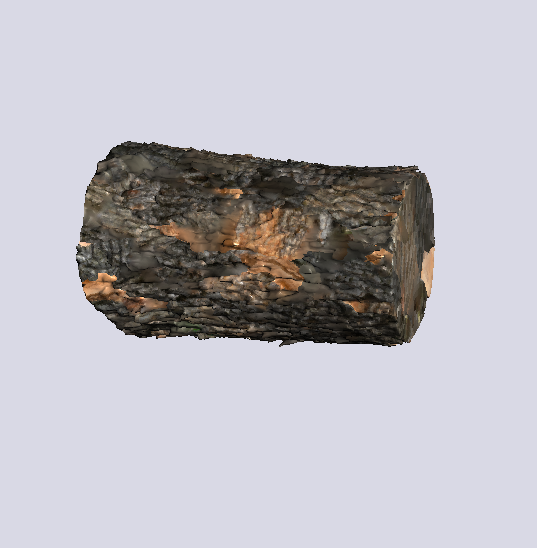

# 🎨 Custom glTF Renderer & Phong Lighting

<p align="center">
  
</p>

### 📖 Project Overview
A lightweight 3D rendering engine written in C++ from scratch using **OpenGL 3.3**. 

This project was developed strictly for **educational purposes** to thoroughly understand the inner workings of the graphics pipeline, low-level GPU memory management, and 3D linear algebra. Instead of using high-level framework wrappers, every major component — from OpenGL object abstractions to the custom model parser — was built from the ground up.

The engine features a **custom glTF 2.0 asset loader** and implements the classic **Phong Lighting Model** using custom GLSL shaders.

---

## 🛠 Tech Stack
* **Language:** C++20
* **Graphics API:** OpenGL 3.3 (Core Profile)
* **Libraries:** GLFW (Window & Input), GLAD (Extension Loader), GLM (OpenGL Mathematics)
* **Build System:** CMake
* **Format Parsers:** Custom JSON/glTF parsing logic

---

## ✨ Key Features

* 📂 **Custom glTF 2.0 Loader:** Parses `.gltf` scenes manually without relying on monolithic libraries like Assimp. Extracts vertex positions, normals, texture coordinates, and indices directly from binary buffers (`.bin`).
* 💡 **Phong Lighting Model:** Implements ambient, diffuse, and specular reflections calculated in World Space inside custom GLSL shaders.
* 🎥 **Interactive 3D Camera:** A custom Fly-Camera system supporting mouse look (pitch/yaw) and keyboard movement (WASD) with smooth delta-time interpolation.
* 🛠️ **GPU Resource Management:** Clean abstraction layers over OpenGL objects (VAO, VBO, EBO, and Shader Programs) enforcing RAII principles.

---
## 🎮 Visuals & Demos

<p align="center">
  
</p>
<p align="center">
  
</p>
---

## ⚙️ Build Instructions

### Requirements:
* Compiler with **C++20** support (GCC, Clang, or MSVC)
* **CMake** 3.15+
* Graphics drivers supporting OpenGL 3.3+

### How to build:
```bash
# 1. Clone the repository
git clone [https://github.com/aeriseek/glTF-loader-and-Phong-Lighting-Demo.git](https://github.com/aeriseek/glTF-loader-and-Phong-Lighting-Demo.git)
cd glTF-loader-and-Phong-Lighting-Demo

# 2. Create build directory
mkdir build
cd build

# 3. Configure and build
cmake ..
cmake --build .
